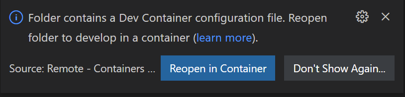
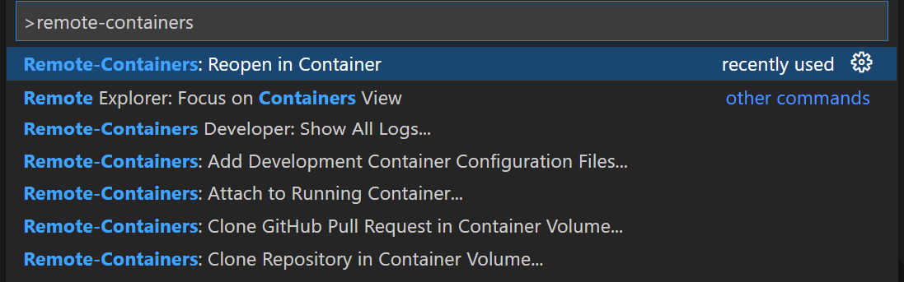
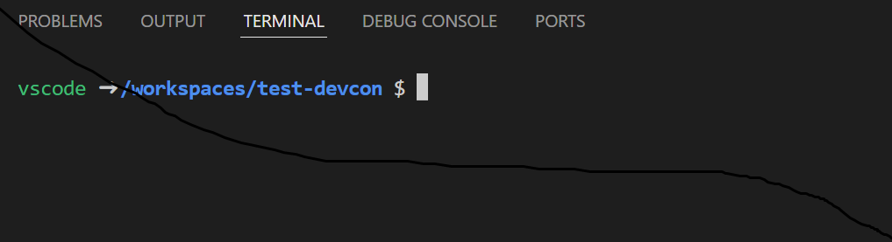

# Common DevContainer

## What is Common DevContainer

Common DevContainer is a Docker container to be used with [Visual Studio Code Remote - Containers](https://code.visualstudio.com/docs/remote/containers) extension for developing software inside a Docker container

Microsoft builds and maintains [development containers](https://github.com/microsoft/vscode-dev-containers/tree/main/containers) to support a range of programming languages and runtimes, _individually_. This project integrates several common and popular languages and runtimes into a single development container

The latest version of this project supports the following languages:

- Python 3.10.4
- Go 1.18.2
- Node.js 16.15.0 (NPM 8.5.5)

## How to build a Common DevContainer

1. Checkout the source code of this repository
1. Change directory to `.devcontainer`
1. Build the image:
   ```bash
   docker build -t <your_container_registry>/<your_repo>:<your_tag> .
   ```

## How to use a built DevContainer

The fastest and easiest way to use Common DevContainer is to create the file `devcontainer.json` in the `.devcontainer`, which should be at the root of your project path, then open the project in VS Code. VS Code would then prompt you to reopen the project in a remote container

The detail is as follows:

### Pre-requisites

* Install the [Visual Studio Code Remote - Containers](https://marketplace.visualstudio.com/items?itemName=ms-vscode-remote.remote-containers) extension

### Steps to use a DevContainer

1. In a command window, go to your project root directory, for example:
   `cd /path/to/myProjectDir/`
1. Create the `.devcontainer` directory:

   ```bash
   mkdir .devcontainer

   cd .devcontainer
   ```

1. Create a file named `.devcontainer.json` inside the directory `.devcontainer`
1. Copy or customize the content from [the sample file](.devcontainer/devcontainer.json) to your version of `.devcontainer.json`
1. Open the project directory in VS Code:
   ```bash
   code /path/to/myProjectDir/
   ```
1. VS Code would detect there is a `.devcontainer/devcontainer.json` file in your project directory and would prompt you to reopen the project in a development container:<br /><br />
1. If you do not see the above prompt, run the **Remote-Containers: Open Folder in Container...** command from the Command Palette (`F1`):<br /><br />
1. You are all set. You may open the terminal to operate the files inside the container
   <br /><br />

### A few points to note

- By default, the Docker image used is `frankyuen/common-devcontainer`, you may customize it in `.devcontainer/devcontainer.json`
- By default, VS Code will automatically "bind" mount your current workspace folder into the container. Again, you may [customize the relevant settings](https://code.visualstudio.com/remote/advancedcontainers/change-default-source-mount) in `.devcontainer/devcontainer.json`
